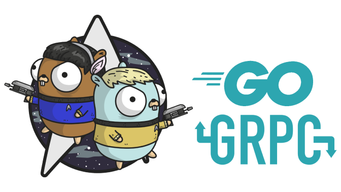
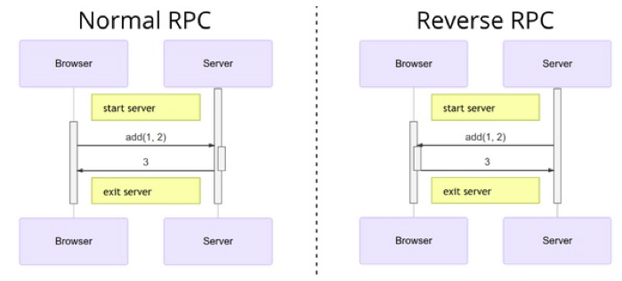

# Chapter 3: RPC và Protobuf

<div align="center">
	
	<br/>
	<span align="center">
		<i></i>
	</span>
</div>
<br/>

>*““Go is not meant to innovate programming theory. It’s meant to innovate programming practice.” – Samuel Tesla*

RPC - Remote Procedure Call (lời gọi hàm từ xa), là một kỹ thuật cho phép chúng ta gọi hàm nằm trong một process khác trên cùng một máy hoặc nằm ở một máy tính khác. Mục tiêu chính của phương pháp này là làm cho lời gọi từ xa RPC tương tự như thể lời gọi thủ tục thông thường cục bộ và ẩn đi việc truyền dữ liệu đi về qua mạng. Chương này sẽ trình bày về cách sử dụng RPC, thiết kế RPC service, và hệ sinh thái RPC được xây dựng dựa trên nền tảng Protobuf của Google.

## 3.1 Bắt đầu với RPC
[Remote Procedure Call](https://en.wikipedia.org/wiki/Remote_procedure_call) ( viết tắt RPC) là phương pháp gọi hàm từ một máy tính từ xa để lấy kết quả. Trong lịch sử phát triển của internet, RPC đã trở thành một cơ sở hạ tầng không thể thiếu cũng như là IPC (inter procress communication) ngoài việc chúng đều dùng để giao tiếp giữa các máy tính chứ không chỉ là các tiến trình. Ngoài ra RPC còn hay được sử dụng trong các hệ thống phân tán.

### 3.1.1 Chương trình “Hello World” bằng RPC

Thư viện chuẩn của GO chứa gói net/rpc dùng để cài đặt chương trình RPC, chương trình RPC đầu tiên của chúng ta sẽ in ra chuỗi “Hello World” được tạo ra và trả về từ máy khác.
service/hello.go: định nghĩa service Hello.

```go
package service
//định nghĩa struct register service
type HelloService struct { }
// định nghĩa hàm service Hello, quy tắc:
// 1. Hàm service phải public (viết Hoa)
// 2. Có hai tham số trong hàm
// 3. Tham số thứ hai phải kiểu con trỏ
// 4. Phải trả về kiểu error
func (p *HelloService) Hello(request string, reply *string) error {
    *reply = "Hello " + request
    // trả về error = nil nếu thành công
    return nil
}

```
**server/main.go**: chương trình phía server.

```go
package main
import (
  "log"
  "net"
  "net/rpc"
  // import rpc service
  "../service"
)
func main() {
    // đăng ký tên service với đối tượng rpc service
    rpc.RegisterName("HelloService", new(HelloService))
    // chạy rpc server trên port 1234
    listener, err := net.Listen("tcp", ":1234")
    // nếu có lỗi thì in ra
    if err != nil {
        log.Fatal("ListenTCP error:", err)
    }
    // vòng lặp để xử lý nhiều client connect
    for {
        // chấp nhận một connection đến
        conn, err := listener.Accept()  
        // in ra nếu bị lỗi khi Accept
        if err != nil {
            log.Fatal("Accept error:", err)
        }
        // service RPC cho client trên một goroutine khác để giải phóng
        // main thread tiếp tục connect client khác
        rpc.ServeConn(conn)
    }   
}
```
**client/main.go**: mã nguồn client để gọi HelloService.

```go
package main
import (
  "fmt"
  "log"
  "net/rpc"
)
func main() {
    // kết nối đến rpc server
    client, err := rpc.Dial("tcp", "localhost:1234")
    // in ra lỗi nếu có
    if err != nil {
        log.Fatal("dialing:", err)
    }
    // biến chứa giá trị trả về sau lời gọi rpc
    var reply string
    // gọi rpc với tên service đã register, tham số và biến
    err = client.Call("HelloService.Hello", "hello", &reply)
    if err != nil {
        log.Fatal(err)
    }
    // in ra kết quả
    fmt.Println(reply)
}
```
Kết quả khi chạy HelloSerivce:

```sh
$ go run server/main.go
```
Phía client:

```sh
$ go run client/main.go
Hello World
```
Qua ví dụ trên, có thể thấy rằng việc dùng RPC trong GO thật sự đơn giản.

### 3.1.2 Tạo interface cho RPC

Ứng dụng sử dụng RPC sẽ có ít nhất ba thành phần:

- Chương trình cài đặt phương thức RPC ở bên phía server.
- Chương trình gọi RPC bên phía client
- ***Service*** đóng vai trò là interface giữa server và client

Trong ví dụ trên, chúng ta đã đặt tất cả những thành phần trên trong 3 folders server, client, service. Nếu bạn muốn refactor lại mã nguồn HelloService, đầu tiên hãy tạo interface như sau:

***Interface của RPC service***:

```go
// tên của service, chứa tiền tố pkg để tránh xung đột tên về sau
const HelloServiceName = "path/to/pkg.HelloService"
// interface RPC của HelloService
type HelloServiceInterface = interface {
    // định nghĩa danh sách các function trong service
    Hello(request string, reply *string) error
}
// đăng ký service
func RegisterHelloService(svc HelloServiceInterface) error {
    // gọi hàm register của net/rpc package
    return rpc.RegisterName(HelloServiceName, svc)
}
```

Sau khi định nghĩa lớp interface của RPC service, client có thể viết mã nguồn để gọi RPC command:

Cài đặt phía client:

```go
// hàm main phía client
func main() {
    // kết nối rpc server qua port 1234
    client, err := rpc.Dial("tcp", "localhost:1234")
    // log ra lỗi nếu có
    if err != nil {
        log.Fatal("dialing:", err)
    }
    // biến chứa kết quả sau khi gọi rpc
    var reply string
    // gọi hàm RPC được định nghĩa phía server
    err = client.Call(HelloServiceName+".Hello", "hello", &reply)
    // log ra chi tiết lỗi nếu có
    if err != nil {
        log.Fatal(err)
    }
}
```

Tuy nhiên, gọi các phương thức RPC thông qua hàm client.Call vẫn rất cồng kềnh, để đơn giản chúng ta nên wrapper biến connection vào trong struct:
Wrapper các đối tượng:

```go
// struct chứa các đối tượng
type HelloServiceClient struct {
    // wrapper server connection
    *rpc.Client
}
var _ HelloServiceInterface = (*HelloServiceClient)(nil)
// tạo hàm wrapper lời gọi Dial tới server
func DialHelloService(network, address string) (*HelloServiceClient, error) {
    // gọi Dial tới server bên trong
    c, err := rpc.Dial(network, address)
    // trả về rỗng và lỗi nếu có
    if err != nil {
        return nil, err
    }
    /trả về rpc struct và error=nil nếu thành công
    return &HelloServiceClient{Client: c}, nil
}
//wrapper lại lời gọi hàm Hello phía client
func (p *HelloServiceClient) Hello(request string, reply *string) error {
    return p.Client.Call(HelloServiceName+".Hello", request, reply)
}
```
Dựa trên các hàm wrapper, chúng ta viết lại client:
Hàm main phía client sau khi refactor:

```go
// kết nối RPC Server bằng hàm wrapper
func main() {
    client, err := DialHelloService("tcp", "localhost:1234")
    if err != nil {
        log.Fatal("dialing:", err)
    }
    // biến lưu kết quả từ lời gọi RPC
    var reply string
    err = client.Hello("hello", &reply)
    // log ra lỗi nếu có
    if err != nil {
        log.Fatal(err)
    }
}
```
Cuối cùng, phía server được viết lại như sau:

Chương trình phía bên server:

```go
//đối tượng RPC HelloService
type HelloService struct {}
// implement từ RPC
func (p *HelloService) Hello(request string, reply *string) error {
    *reply = "hello:" + request
    return nil
}
// hàm main phía server
func main() {
    // gọi wrapper đăng ký đối tượng HelloService
    RegisterHelloService(new(HelloService))
    // lắng nghe kết nối từ phía client
    listener, err := net.Listen("tcp", ":1234")
    // log ra lỗi nếu có (VD: trùng port, vvv)
    if err != nil {
        log.Fatal("ListenTCP error:", err)
    }
    // vòng lặp tiếp nhận nhiều client connect
    for {
        // chấp nhận 1 client connect nào đó.
        conn, err := listener.Accept()
        if err != nil {
            log.Fatal("Accept error:", err)
        }
        // connect service trên một gorotine khác để main thread tiếp tục vòng lặp accept client khác
        go rpc.ServeConn(conn)
    }
}
```
Ở phiên bản refactor, chúng ta sử dụng hàm RegisterHelloService để đăng ký RPC service, nó tránh việc trực tiếp đặt tên cho serice, và đảm bảo mọi đối tượng implement các hàm trong interface của RPC service đều có thể phục vụ lời gọi RPC từ phía client.

### 3.1.3 Vấn đề gọi RPC trên các ngôn ngữ khác nhau

Trong hệ thống microservice, mỗi service có thể viết bằng các ngôn ngữ lập trình khác nhau, do đó để ***cross-language*** (vượt qua rào cả ngôn ngữ) là điều kiện thiết yếu cho sự tồn tại của RPC trong môi trường internet.

Thư viện chuẩn RPC của GO mặc định đóng gói dữ liệu theo đặc tả của [GO Encoding](https://golang.org/pkg/encoding/), do đó sẽ rất khó để gọi RPC Service từ những ngôn ngữ khác.

May mắn là thư viện ```net/rpc``` của GO có ít nhất hai thiết kế đặc biệt:
- Một là cho phép chúng ta có thể thay đổi quá trình encoding và decoding gói tin RPC.
- Hai là interface RPC được xây dựng dựa trên interface ```io.ReadWriteClose```, chúng ta có thể xây dựng RPC trên những protocol giao tiếp khác nhau.

Từ đây chúng ta có thể triển khai cross-language thông qua gói ```net/rpc/jsonrpc```:

```go
package main
import(
	"log"
	"net"
	"net/rpc"
	"net/rpc/jsonrpc"
)
// define register service struct
type HelloService struct {}
func (p *HelloService) Hello(request string, reply *string) error {
	*reply = "Hello, " + request
	// return error = null nếu thành công
	return nil
}
func main() {
	 // register HelloService (dùng cách cũ cho đơn giản)
    rpc.RegisterName("HelloService", new(HelloService))
    // lắng nghe connection từ client
    listener, err := net.Listen("tcp", ":1234")
    if err != nil {
        log.Fatal("ListenTCP error:", err)
    }
    for {
        conn, err := listener.Accept()
        if err != nil {
            log.Fatal("Accept error:", err)
        }
		 // client service trên một goroutine khác, lúc này:
		 // 1. rpc.ServeConn được thay thế bằng rpc.ServeCodec
		 // 2. dùng jsonrpc.NewServerCodec để bao đối tượng conn
        go rpc.ServeCodec(jsonrpc.NewServerCodec(conn))
    }
}
```
Mã nguồn bên phía client sẽ thay đổi như sau:

***Hàm main bên phía client***:

```go
package main
import (
	"fmt"
	"log"
	"net"
	"net/rpc"
	"net/rpc/jsonrpc"
)
func main() {
	 // connect to RPC server
    conn, err := net.Dial("tcp", "localhost:1234")
    if err != nil {
        log.Fatal("net.Dial:", err)
    }
	 // call RPC Service đc encoding bằng json Codec
    client := rpc.NewClientWithCodec(jsonrpc.NewClientCodec(conn))
	 // biến lưu giá trị sau lời gọi hàm rpc
    var reply string
    // call RPC Service
    err = client.Call("HelloService.Hello", "hello", &reply)
    if err != nil {
        log.Fatal(err)
    }
	 // in ra kết quả
    fmt.Println(reply)
}
```
***Kết quả***:

- Server

```sh
$ go run server/main.go
```

- Client:

```sh
$ go run client/main.go
Hello, World
```

Để thấy dữ liệu được client gửi cho server, đầu tiên tắt chương trình server gọi lệnh [nc](http://www.tutorialspoint.com/unix_commands/nc.htm):

```sh
$ go run server/main.go
// Ctrl+C
$nc -l 1234
```
Sau đó gọi chương trình client ```$ go run client/main.go``` một lần nữa, ta sẽ thấy kết quả:

```json
$ nc -l 1234
{"method":"HelloService.Hello","params":["World"],"id":0}
```
Dữ liệu json trên tương ứng với hai cấu trúc: client là ```clientRequest``` và server là ```serverRequest```. Nội dung của cấu trúc ```clientRequest``` và ```serverRequest``` về cơ bản là giống nhau:

```go
// cấu trúc json phía client
type clientRequest struct {
    Method string         `json:"method"`
    Params [1]interface{} `json:"params"`
    Id     uint64         `json:"id"`
}
// cấu trúc json phía server
type serverRequest struct {
    Method string           `json:"method"`
    Params *json.RawMessage `json:"params"`
    Id     *json.RawMessage `json:"id"`
}
```
Ở chiều ngược lại, nếu muốn thấy thông điệp mà phía server gửi cho client, chạy RPC service phía server: ``` $go run server/main.go ``` và ở một terminal khác chạy command:

```sh 
$ echo -e '{"method":"HelloService.Hello","params":["hello"],"id":1}' | nc localhost 1234
```

Kết quả mà RPC server trả về

```json
{"id":1,"result":"Hello, World","error":null}
```
Trong đó:

- "id": để nhận dạng kết quả ứng với yêu cầu vì việc thực thi lời gọi RPC là bất đồng bộ
- "result": kết quả trả về của lời gọi hàm
- "error": chứa thông điệp lỗi nếu có

Dữ liệu json được trả về ở trên sẽ tương ứng với hai cấu trúc client là ```clientResponse``` và server là ```serverResponse```. Nội dung của hai cấu trúc cũng tương tự nhau:

```go
type clientResponse struct {
    Id     uint64           `json:"id"`
    Result *json.RawMessage `json:"result"`
    Error  interface{}      `json:"error"`
}

type serverResponse struct {
    Id     *json.RawMessage `json:"id"`
    Result interface{}      `json:"result"`
    Error  interface{}      `json:"error"`
}
```

Vì vậy, dù sử dụng bất kỳ ngôn ngữ nào, chỉ cần tuân theo json format là có thể giao tiếp với RPC service được viết bởi GO hay bất kỳ ngôn ngữ nào khác, nói cách khác ta có thể thực hiện việc cross-language trong RPC.

### 3.1.4 Go RPC qua HTTP Protocol

RPC Framework vốn có trong GO đã hỗ trợ việc cung cấp các RPC Service trên HTTP Protocol. Tuy nhiên HTTP serivce của framework cũng tích hợp [GOB](https://golang.org/pkg/encoding/gob/) protocol và không cung cấp interface sử dụng các giao thức khác, do đó, nó vẫn không thể truy cập được từ các ngôn ngữ khác.

Trong ví dụ trước, chúng ta đã triển khai ```jsonrpc``` trên giao thức TCP và thực hiện thành công lệnh gọi RPC thông qua công cụ ```nc```. Bây giờ chúng ta sẽ thử cấp ```jsonrpc``` trên HTTP Protocol. RPC Service mới sẽ tuân thủ theo chuẩn [REST](https://restfulapi.net/),

```go
func main() {
    rpc.RegisterName("HelloService", new(HelloService))
	 // routing uri/jsonrpc đến hàm xử lý tương ứng
    http.HandleFunc("/jsonrpc", func(w http.ResponseWriter, r *http.Request) {
    	 // conn là một kiểu io.ReadWriteCloser
        var conn io.ReadWriteCloser = struct {
        	  // là struct gồm đọc và ghi
            io.Writer
            io.ReadCloser
        }{  // được khởi tạo với nội dụng:
        	  // ReadCloser là nội dung nhận được
            ReadCloser: r.Body,
            // Writer là đối tượng dùng ghi kết quả
            Writer: w,
        }
		  // truyền RPC service với biến conn
        rpc.ServeRequest(jsonrpc.NewServerCodec(conn))
    })
	 // lắng nghe kết nối từ client trên port 1234
    http.ListenAndServe(":1234", nil)
}
```
Lệnh gọi RPC để gửi json đến kết nối đó:

```sh
$ curl localhost:1234/jsonrpc -X POST \
    --data '{"method":"HelloService.Hello","params":["hello"],"id":0}'
```
Kết quả vẫn là một json:

```json
{"id":0,"result":"hello:hello","error":null}
```
Điều đó làm việc gọi RPC service từ những ngôn ngữ khác dễ dàng hơn.

## 3.2 Protobuf

[Protobuf](https://developers.google.com/protocol-buffers/) (Protocols Buffer) là một language-neutral, platform-neutral của Google. Về cơ bản, nó được sử dụng để sinh ra mã nguồn với chức năng serialize và deserialize các cấu trúc dữ liệu (được định nghĩa trong file ```.proto```) dưới dạng binary stream. So với dạng XML hoặc JSON thì dữ liệu nhỏ gọn hơn 3-10 lần và được xử lý rất nhanh.
<div align="center">
	
	<br/>
	<span align="center">
		<i></i>
	</span>
</div>
<br/>
<div align="center">
	
	<br/>
	<span align="center">
		<i></i>
	</span>
</div>
<br/>
Xem thêm: [Benchmarking Protocol Buffers, JSON and XML in Go](https://medium.com/@shijuvar/benchmarking-protocol-buffers-json-and-xml-in-go-57fa89b8525).

Bạn có thể cài đặt và làm quen với các ví dụ Protobuf trên [trang chủ](https://developers.google.com/protocol-buffers/docs/gotutorial) trước khi đi vào nội dung chính.

### 3.2.1 Kết hợp Protobuf trong RPC

Đầu tiên chúng ta tạo file ```hello.proto``` chứa kiểu ```string``` được dùng cho HelloSerice ở phần trước.

***hello.proto***:

```go
// hiện có 2 versions là proto2 và proto3
syntax = "proto3";
// tên package được sinh ra
package main;
// message là một đơn vị dữ liệu trong protobuf
message String {
	 // chuỗi string được truyền vào hàm RPC
    string value = 1;
}
```
Để sinh ra mã nguồn GO từ file ```hello.proto``` trên, đầu tiên là cài đặt bộ biên dịch [protoc](https://github.com/protocolbuffers/protobuf/releases), sau đó cài đặt một plugin cho GO thông qua lệnh:

```sh
$ go get github.com/golang/protobuf/protoc-gen-go
```
Chúng ta sẽ sinh ra mã nguồn GO bằng lệnh sau:

```sh
$ protoc --go_out=. hello.proto
```
Trong đó:

- protoc: chương trình sinh ra mã nguồn
- go__out: chỉ cho protoc tải plugin protoc-gen-go, (cũng có java_out, python_out,...)
- --go-out=.: sinh ra mã nguồn tại folder hiện tại
- hello.proto: file protobuf

Sẽ có một file hello.pb.go được sinh ra, trong đó cấu trúc ```String``` được định nghĩa như sau:

```go
type String struct {
    Value string `protobuf:"bytes,1,opt,name=value" json:"value,omitempty"`
}

func (m *String) Reset() { *m = String{} }
func (m *String) String() string { return proto.CompactTextString(m) }
func (*String) ProtoMessage()    {}
func (*String) Descriptor() ([]byte, []int) {
    return fileDescriptor_hello_069698f99dd8f029, []int{0}
}

func (m *String) GetValue() string {
    if m != nil {
        return m.Value
    }
    return ""
}

```
Dựa trên kiểu ```String``` mới, chúng ta có thể implement lại HelloService, với sự kết hợp giữa Protobuf trong RPC.
***hello.go***:

```go
// RPC struct
type HelloService struct{}
// định nghĩa hàm Hello RPC, với tham số là kiểu String vừa định nghĩa trong Protobuf
func (p *HelloService) Hello(request *String, reply *String) error {
	 // các hàm như .GetValue() đã được tạo ra trong file hello.pb.go
    reply.Value = "hello:" + request.GetValue()
    // trả về nil khi thành công
    return nil
}
```
Khi implement một RPC service, chúng ta có thể chọn kiểu encoding mặc định hoặc định nghĩa lại với kiểu dữ liệu JSON như phần trước, và sau đó sẽ implement lại plugin dựa trên mã nguồn protobuf.

Cập nhật file ```hello.proto``` như sau để định nghĩa HelloService thông qua protobuf.
***hello.proto***:

```go
// định nghĩa service
service HelloService {
	 // định nghĩa lời gọi hàm RPC 
    rpc Hello (String) returns (String);
}
```
Nhưng khi sinh lại mã nguồn GO bằng lệnh protoc ở ví dụ đầu tiên, nội dung file ```hello.pb.go``` cũng không thay đổi, đó là vì bộ biên dịch ```protoc`` sẽ không biết cách sinh ra mã nguồn RPC như thế nào.

Dùng plugin ```grpc``` đã được tích hợp bên trong ```protoc-gen-go``` để sinh ra mã nguồn [gRPC](https://grpc.io/) cho HelloService.

```sh
$ protoc --go_out=plugins=grpc:. hello.proto
```
Trong đó ```--go__out=plugins=grpc```: cho biết dùng plugin grpc

Trong mã nguồn được sinh ra, sẽ có một số kiểu mới là HelloServiceServer, HelloServiceClient. Các loại mới đó dành cho gRPC và không đáp ứng các yêu cầu RPC của chúng ta.

Tuy nhiên, gRPC plugin cung cấp cho chúng ta một ý tưởng cải tiến. Sau đây chúng ta sẽ khám phá các tạo mã bảo mật cho RPC.
### 3.2.2 Tuỳ chỉnh plugin sinh ra mã nguồn
Bộ biên dịch ```protoc``` của Protobuf được implement để sinh ra những ngôn ngữ khác nhau dựa vào plugin. Ví dụ, nếu lệnh protoc có tham số là ```--xyz_out```, thì protoc sẽ gọi plugin được xây dựng dựa trên ngôn ngữ ```xyz``` (ví dụ ```protoc-gen-go```).

Từ [mã nguồn gRPC plugin](https://chromium.googlesource.com/external/github.com/golang/protobuf/+/master/protoc-gen-go/grpc/grpc.go), chúng ta có thể thấy rằng hàm ```generator.RegisterPlugin``` được dùng để đăng ký ```plugin``` đó. Interface của một plugin sẽ như sau:

```go
// A Plugin provides functionality to add to the output during
// Go code generation, such as to produce RPC stubs.
type Plugin interface {
    // Name identifies the plugin.
    Name() string
    // Init is called once after data structures are built but before
    // code generation begins.
    Init(g *Generator)
    // Generate produces the code generated by the plugin for this file,
    // except for the imports, by calling the generator's methods P, In,
    // and Out.
    Generate(file *FileDescriptor)
    // GenerateImports produces the import declarations for this file.
    // It is called after Generate.
    GenerateImports(file *FileDescriptor)
}
```
Do đó, chúng ta có thể xây dựng một plugin mang tên ```netrpcPlugin``` để sinh ra mã nguồn cho thư viện RPC chuẩn của GO từ file Protobuf.

```go
import (
	// import gói thư viện để sinh ra plugin
    "github.com/golang/protobuf/protoc-gen-go/generator"
)
// định nghĩa struct netrpcPlugin implement Plugin interface
type netrpcPlugin struct{ *generator.Generator }
// định nghĩa Name() function
func (p *netrpcPlugin) Name() string                { return "netrpc" }
// định nghĩa Init() function
func (p *netrpcPlugin) Init(g *generator.Generator) { p.Generator = g }
// định nghĩa GenerateImports()
func (p *netrpcPlugin) GenerateImports(file *generator.FileDescriptor) {
    if len(file.Service) > 0 {
        p.genImportCode(file)
    }
}
// định nghĩa Generate()
func (p *netrpcPlugin) Generate(file *generator.FileDescriptor) {
    for _, svc := range file.Service {
        p.genServiceCode(svc)
    }
}
```
Hiện tại, phương thức ```genImportCode``` và ```genServiceCode``` chỉ như sau:

```go
func (p *netrpcPlugin) genImportCode(file *generator.FileDescriptor) {
    p.P("// TODO: import code")
}

func (p *netrpcPlugin) genServiceCode(svc *descriptor.ServiceDescriptorProto) {
    p.P("// TODO: service code, Name = " + svc.GetName())
}
```
Để sử dụng plugin, chúng ta cần đăng ký plugin đó với hàm ```generator.RegisterPlugin```, chúng ta có thể implement nhờ vào hàm ```init()```.

```go
func init() {
    generator.RegisterPlugin(new(netrpcPlugin))
}
```
Bởi vì trong GO, package chỉ được import tĩnh, chúng ta không thể thêm plugin mới vào plugin đã có sẵn là ```protoc-gen-go```. Chúng ta sẽ ```re-clone``` lại hàm main để build lại ```protoc-gen-go```

```go
package main

import (
    "io/ioutil"
    "os"
	 // import các package cần thiết
    "github.com/golang/protobuf/proto"
    "github.com/golang/protobuf/protoc-gen-go/generator"
)
// bắt đầu lại hàm main
func main() {
	 // sinh ra một đối tượng plugin mới
    g := generator.New()
	 // đọc lệnh từ console vào biến data
    data, err := ioutil.ReadAll(os.Stdin)
    if err != nil {
        g.Error(err, "reading input")
    }
	 // unmarshal data thành cấu trúc request
    if err := proto.Unmarshal(data, g.Request);
    err != nil {
        g.Error(err, "parsing input proto")
    }
	 // kiểm tra tên file có hợp lệ không?
    if len(g.Request.FileToGenerate) == 0 {
        g.Fail("no files to generate")
    }
	 // đăng ký các tham số
    g.CommandLineParameters(g.Request.GetParameter())
    // Create a wrapped version of the Descriptors and EnumDescriptors that
    // point to the file that defines them.
    g.WrapTypes()
	 // thiết lập tên package
    g.SetPackageNames()
    g.BuildTypeNameMap()
	 // sinh ra các file mã nguồn
    g.GenerateAllFiles()

    // Send back the results.
    data, err = proto.Marshal(g.Response)
    if err != nil {
        g.Error(err, "failed to marshal output proto")
    }
    _, err = os.Stdout.Write(data)
    if err != nil {
        g.Error(err, "failed to write output proto")
    }
}
```
Để tránh việc trùng tên với protoc-gen-go plugin, chúng ta sẽ đặt tên cho chương trình thực thi trên là ```protoc-gen-go-netrpc``` (điều đó có ý nghĩa là plugin đã bao gồm ```netrpc```). Sau đó chúng ta sẽ biên dịch lại ```hello.proto``` với lệnh sau:

```sh
$ protoc --go-netrpc_out=plugins=netrpc:. hello.proto
```
Tham số ```--go-netrpc_out``` sẽ nói cho bộ biên dịch protoc biết nó phải tải một plugin với tên gọi là ```protoc-gen-go-netrpc```.

### 3.2.3 Generate toàn bộ mã nguồn RPC.
Trong ví dụ trước chúng ta đã xây dựng một plugin nhỏ là ```netrpcPlugin``` và tạo ra một plugin mới là ```protoc-gen-go-netrpc``` bởi việc sao chép lại chương trình chính của protoc-gen-go.
Bây giờ, tiếp túc phát triển netrpcPlugin với mục tiêu cuối cùng là gen ra interface RPC. Đầu tiên chúng ta sẽ phải implement genImportCode:

```go
func (p *netrpcPlugin) genImportCode(file *generator.FileDescriptor) {
    p.P(`import "net/rpc"`)
}
```
Chúng ta sẽ định nghĩa kiểu ServiceSpec được mô tả như là thông tin thêm vào của service.

```go
type ServiceSpec struct {
	// tên của service
    ServiceName string
    // Danh sách các method
    MethodList  []ServiceMethodSpec
}

type ServiceMethodSpec struct {
    MethodName     string
    InputTypeName  string
    OutputTypeName string
}
```
Chúng ta sẽ tạo ra một method ```buildServiceSpec```, nó sẽ parse thông tin thêm vào service được định nghĩa trong ServiceSpec cho mỗi service.

```go
// buildServiceSpec method
func (p *netrpcPlugin) buildServiceSpec(
	// tham số truyền vào thuộc kiểu ServiceDescriotionProto
	// mô tả thông tin về service
    svc *descriptor.ServiceDescriptorProto,
) *ServiceSpec {
	 // khởi tạo đối tượng
    spec := &ServiceSpec{
    	 // svc.GetName(): lấy tên service được định nghĩa ở Protobuf file
    	 // sau đó chuyên đổi chúng về style CamelCase
        ServiceName: generator.CamelCase(svc.GetName()),
    }
	 // với mỗi RPC method, ta thêm một cấu trúc tương ứng vào danh sách
    for _, m := range svc.Method {
        spec.MethodList = append(spec.MethodList, ServiceMethodSpec{
        	  // m.GetName(): lấy tên method
            MethodName:     generator.CamelCase(m.GetName()),
            // m.GetInputType(): lấy kiểu dữ liệu tham số đầu vào
            InputTypeName:  p.TypeName(p.ObjectNamed(m.GetInputType())),
            OutputTypeName: p.TypeName(p.ObjectNamed(m.GetOutputType())),
        })
    }
    // trả về cấu trúc trên
    return spec
}
```
Sau đó chúng ta sẽ gen mã nguồn của service dựa trên thông tin mô tả đó, được xây dựng bởi ```buildServiceSpec``` method:

```go
func (p *netrpcPlugin) genServiceCode(svc *descriptor.ServiceDescriptorProto){  // hàm được định nghĩa ở trên
    spec := p.buildServiceSpec(svc)
	// buf là biến chứa dữ liệu
    var buf bytes.Buffer
    //dùng tmplService cho việc gen mã nguồn
    t := template.Must(template.New("").Parse(tmplService))
    // thực thi việc sinh mã nguồn
    err := t.Execute(&buf, spec)
    if err != nil {
        log.Fatal(err)
    }
	 // ghe buf.String() vào file
    p.P(buf.String())
}
```
Chúng ta mong đợi vào mã nguồn cuối cùng được sinh ra như sau:

```go
type HelloServiceInterface interface {
    Hello(in String, out *String) error
}

func RegisterHelloService(srv *rpc.Server, x HelloService) error {
    if err := srv.RegisterName("HelloService", x); err != nil {
        return err
    }
    return nil
}

type HelloServiceClient struct {
    *rpc.Client
}

var _ HelloServiceInterface = (*HelloServiceClient)(nil)

func DialHelloService(network, address string) (*HelloServiceClient, error) {
    c, err := rpc.Dial(network, address)
    if err != nil {
        return nil, err
    }
    return &HelloServiceClient{Client: c}, nil
}

func (p *HelloServiceClient) Hello(in String, out *String) error {
    return p.Client.Call("HelloService.Hello", in, out)
}
```
Để được như vậy, template của chúng ta viết như sau:

```go
const tmplService =
{{$root := .}}

type {{.ServiceName}}Interface interface {
    {{- range $_, $m := .MethodList}}
    {{$m.MethodName}}(*{{$m.InputTypeName}}, *{{$m.OutputTypeName}}) error
    {{- end}}
}

func Register{{.ServiceName}}(
    srv *rpc.Server, x {{.ServiceName}}Interface,
) error {
    if err := srv.RegisterName("{{.ServiceName}}", x); err != nil {
        return err
    }
    return nil
}

type {{.ServiceName}}Client struct {
    *rpc.Client
}

var _ {{.ServiceName}}Interface = (*{{.ServiceName}}Client)(nil)

func Dial{{.ServiceName}}(network, address string) (
    *{{.ServiceName}}Client, error,
) {
    c, err := rpc.Dial(network, address)
    if err != nil {
        return nil, err
    }
    return &{{.ServiceName}}Client{Client: c}, nil
}

{{range $_, $m := .MethodList}}
func (p *{{$root.ServiceName}}Client) {{$m.MethodName}}(
    in *{{$m.InputTypeName}}, out *{{$m.OutputTypeName}},
) error {
    return p.Client.Call("{{$root.ServiceName}}.{{$m.MethodName}}", in, out)
}
{{end}}
```
Khi plugin mới của protoc được hoàn thành, mã nguồn có thể được sinh ra mỗi khi RPC service thay đổi trong file ```hello.proto```. Chúng ta có thể điều chỉnh hoặc thêm nội dung của mã nguồn được sinh ra bằng việc cập nhật template plugin.

## 3.3 RPC trong Golang

Chúng ta có thể sử dụng RPC cho nhiều mục đích khác nhau, vì vậy cộng đồng Open source đã tạo ra khá nhiều framework RPC để hỗ trợ cho việc lập trình. Trong phần này, chúng ta sẽ sử dụng framework RPC tích hợp sẵn trong Go cho các implement của một số trường hợp.
### 3.3.1 Implement RPC phía client

Cách dễ dàng nhất để sử dụng thư viện GO là dùng phương thức ```Client.Call``` để thực hiện lời gọi đồng bộ (synschronous blocking). Phần implement của phương thức này như sau:

```go
func (client *Client) Call(
    serviceMethod string, args interface{},
    reply interface{},
) error {
    call := <-client.Go(serviceMethod, args, reply, make(chan *Call, 1)).Done
    return call.Error
}
```
Chúng ta cũng có thể dùng ```client.Go``` gọi tới service trước đó là ```HelloService``` theo kiểu bất đồng bộ (synchronous blocking) bằng phương pháp sau:

```go
func doClientWork(client *rpc.Client) {
    helloCall := client.Go("HelloService.Hello", "hello", new(string), nil)

    // do some thing

    helloCall = <-helloCall.Done
    if err := helloCall.Error; err != nil {
        log.Fatal(err)
    }

    args := helloCall.Args.(string)
    reply := helloCall.Reply.(string)
    fmt.Println(args, reply)
}
```
Sau khi lệnh gọi bất đồng bộ được thực hiện, các tác vụ khác sẽ được thực thi, sau đó các tham số đầu vào và giá trị trả về của lời gọi bất đồng bộ có thể lấy ra từ biến ```Call``` trả về.

Phương thức ```Client.Go``` thực thi một lời gọi bất đồng bộ được implement như sau:

```go
func (client *Client) Go(
    serviceMethod string, args interface{},
    reply interface{},
    done chan *Call,
) *Call {
	 // khởi tạo một biến lời gọi đại diện cho cuộc gọi hiện thời
    call := new(Call)
    call.ServiceMethod = serviceMethod
    call.Args = args
    call.Reply = reply
    call.Done = make(chan *Call, 10) // buffered channel.
	 // gửi đi tham số call đến RPC framework.
	 // Client.send method thread-safe cho nên lệnh gọi có thể
	 // gửi từ nhiều Goroutine đồng thời tới cùng một đường link RPC.
    client.send(call)
    return call
}
```
Tham khảo thêm [net/rpc/client.go](https://golang.org/src/net/rpc/client.go).

Khi lời gọi hoàn thành hoặc có lỗi xuất hiện, phương thức thông báo ```call.done``` được gọi để hoàn thành:

```go
func (call *Call) done() {
    select {
    case call.Done <- call:
        // ok
    default:
        // sử dụng default sẽ không bị block chương trình.
        // đảm bảo channel có đủ vùng nhớ cho buffer.
    }
}
```
Từ phần implement của phương thức ```Call.done```, có thể thấy rằng ```call.done``` sẽ trả về lời gọi đã xử lý.

### 3.3.2. Implement hàm giám sát bằng RPC

Ta mong muốn khi hệ thống gặp phải những điều kiện nhất định thì có thể nhận về kết quả thông báo. Trong phần này ta sẽ thực hiện phương thức ```Watch``` để làm điều đó.

Ý tưởng là giả lập một key-value store đơn giản, mỗi khi có sự thay đổi về value thì sẽ gửi về thông báo cho client.

Trước tiên xây dựng cơ sở dữ liệu Key-Value đơn giản thông qua RPC. Service như sau:

```go
type KVStoreService struct {
	 // map lưu trữ key-value
    m      map[string]string
    // map chứa danh sách các hàm filter được xác định trong mỗi call
    filter map[string]func(key string)
    mu     sync.Mutex
}

func NewKVStoreService() *KVStoreService {
    return &KVStoreService{
        m:      make(map[string]string),
        filter: make(map[string]func(key string)),
    }
}
```
Tiếp theo là Get và Set methods:

```go
func (p *KVStoreService) Get(key string, value *string) error {
    p.mu.Lock()
    defer p.mu.Unlock()

    if v, ok := p.m[key]; ok {
        *value = v
        return nil
    }

    return fmt.Errorf("not found")
}

func (p *KVStoreService) Set(kv [2]string, reply *struct{}) error {
    p.mu.Lock()
    defer p.mu.Unlock()

    key, value := kv[0], kv[1]

    if oldValue := p.m[key]; oldValue != value {
    	 // hàm filter được gọi khi value tương ứng với key bị sửa đổi
        for _, fn := range p.filter {
            fn(key)
        }
    }

    p.m[key] = value
    return nil
}
```
Các filter sẽ được cung cấp trong cách phương thức ```Watch```:

```go
// Watch trả về key mỗi khi nhận thấy có sự thay đổi
func (p *KVStoreService) Watch(timeoutSecond int, keyChanged *string) error {
	 // id là một string ghi lại thời gian
    id := fmt.Sprintf("watch-%s-%03d", time.Now(), rand.Int())
    ch := make(chan string, 10) // buffered channel chứa key
	 // filter để theo dõi key thay đổi
    p.mu.Lock()
    p.filter[id] = func(key string) { ch <- key }
    p.mu.Unlock()

    select {
    // trả về timeout sau một khoảng thời gian
    case <-time.After(time.Duration(timeoutSecond) * time.Second):
        return fmt.Errorf("timeout")
    case key := <-ch:
        *keyChanged = key
        return nil
    }
    return nil
}
```
Quá trình đăng ký và khởi động service ```KVStoreService``` bạn có thể xem lại phần trước. Hãy xem cách sử dụng phương thức ```Watch``` từ client:

```go
func doClientWork(client *rpc.Client) {
	 // khởi chạy một Goroutine riêng biệt để giám sát key thay đổi
    go func() {
        var keyChanged string
        // lời gọi `watch` synchronous sẽ block cho đế khi
        // có key thay đổi hoặc timeout
        err := client.Call("KVStoreService.Watch", 30, &keyChanged)
        if err != nil {
            log.Fatal(err)
        }
        fmt.Println("watch:", keyChanged)
    } ()
    // value KV được thay đổi bằng phương thức `Set`
    err := client.Call(
        "KVStoreService.Set", [2]string{"abc", "abc-value"},
        new(struct{}),
    )
    if err != nil {
        log.Fatal(err)
    }
    
    time.Sleep(time.Second*3)
}
```
Server sẽ trả về key đã thay đổi thông qua ```Watch``` method. Bằng cách này ta có thể giám sát việc thay dổi trạng thái key.

### 3.3.3 Reverse RPC

RPC thường được sử dụng trong mô hình client-server. Trong đó server và client cần dùng chung một network. Tuy nhiên, đối với một số trường hợp đặc biệt, chẳng hạn như khi cung cấp RPC service trên mạng nội bộ, nhưng mạng bên ngoài không thể connect tới server mạng nội bộ.
<div align="center">
	
	<br/>
	<span align="center">
		<i>Reverse RPC</i>
	</span>
</div>
<br/>
Trong trường hợp này, có thể sử dụng công nghệ tương tự nhu reverse proxy. Trước tiên chủ động kết nối với server TCP của mạng bên ngoài từ mạng nội bộ, sau đó cung cấp RPC service cho mạng bên ngoài dựa trên TCP connect đó.

Sau đây là mã nguồn để khởi động một reverse RPC service:

```go
func main() {
    rpc.Register(new(HelloService))

    for {
        conn, _ := net.Dial("tcp", "localhost:1234")
        if conn == nil {
            time.Sleep(time.Second)
            continue
        }

        rpc.ServeConn(conn)
        conn.Close()
    }
}
```
Reverse RPC service sẽ không còn cung cấp service lắng nghe TCP, Thay vào đó nó sẽ chủ động kết nối với server TCP của client (có thể coi là đảo ngược vai trò client-server). RPC service sau đó được cung cấp dựa trên mỗi liên kết TCP được thiết lập.

RPC client cần cung cấp một TCP service có địa chỉa công khai để chấp nhật request từ RPC server:

```go
func main() {
    listener, err := net.Listen("tcp", ":1234")
    if err != nil {
        log.Fatal("ListenTCP error:", err)
    }

    clientChan := make(chan *rpc.Client)

    go func() {
        for {
            conn, err := listener.Accept()
            if err != nil {
                log.Fatal("Accept error:", err)
            }
			  // khi mỗi đường link được thiết lập, đối tượng RPC client 
			  // được khởi tạo dựa trên link đó và gửi tới client channel
            clientChan <- rpc.NewClient(conn)
        }
    }()
    doClientWork(clientChan)
}
```
Client thực hiện lời gọi RPC trong ```doClientWork``` method:

```go
func doClientWork(clientChan <-chan *rpc.Client) {
	 // nhận vào đối tượng RPC client từ channel
    client := <-clientChan
    // đóng kết nối với client trước khi hàm exit
    defer client.Close()

    var reply string
    // thực hiện lời gọi rpc bình thường
    err = client.Call("HelloService.Hello", "hello", &reply)
    if err != nil {
        log.Fatal(err)
    }
    fmt.Println(reply)
}
```
### 3.3.4 RPC theo ngữ cảnh (context)

Dựa trên ngữ cảnh (context) chúng ta có thể cung cấp những RPC services thích hợp cho những client khác nhau.
Ta có thể hỗ trợ các tính năng theo ngữ cảnh bằng cách cung cấp các RPC service cho từng link kết nối.

Đầu tiên thêm vào thành phần ```conn``` ở ```HelloService``` cho link tương ứng:

```go
type HelloService struct {
    conn net.Conn
}
```
Sau đó bắt đầu một RPC service riêng cho từng link:

```go
func main() {
    listener, err := net.Listen("tcp", ":1234")
    if err != nil {
        log.Fatal("ListenTCP error:", err)
    }

    for {
        conn, err := listener.Accept()
        if err != nil {
            log.Fatal("Accept error:", err)
        }

        go func() {
            defer conn.Close()

            p := rpc.NewServer()
            p.Register(&HelloService{conn: conn})
            p.ServeConn(conn)
        } ()
    }
}
```
Trong ```Hello``` method, bạn có thể xác định lời gọi RPC cho các link khác nhau dựa trên biến ```conn```:

```go
func (p *HelloService) Hello(request string, reply *string) error {
    *reply = "hello:" + request + ", from" + p.conn.RemoteAddr().String()
    return nil
}
```
Dựa vào thông tin ngữ cảnh mà chúng ta có thể dễ dàng thêm vào một cơ chế xác minh trạng thái đăng nhập đơn giản cho RPC service:

```go
type HelloService struct {
    conn    net.Conn
    isLogin bool
}

func (p *HelloService) Login(request string, reply *string) error {
    if request != "user:password" {
        return fmt.Errorf("auth failed")
    }
    log.Println("login ok")
    p.isLogin = true
    return nil
}

func (p *HelloService) Hello(request string, reply *string) error {
    if !p.isLogin {
        return fmt.Errorf("please login")
    }
    *reply = "hello:" + request + ", from" + p.conn.RemoteAddr().String()
    return nil
}
```
Theo cách này, khi client kết nối tới RPC service, chức năng login sẽ được thực hiện trước, và các service khác có thể thực thi bình thường sau khi login thành công.