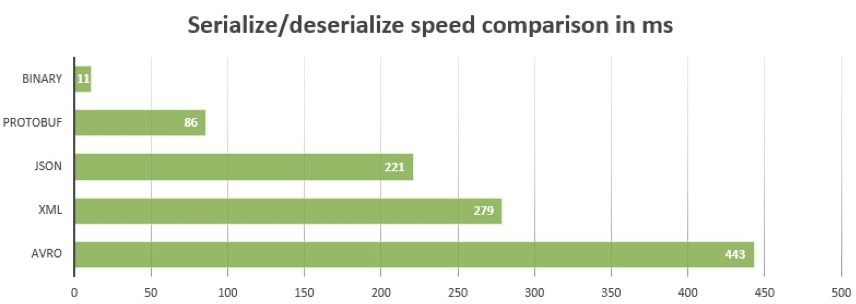

# 3.2 Protobuf

[Protobuf](https://developers.google.com/protocol-buffers/) (Protocols Buffer) là một language-neutral, platform-neutral của Google. Về cơ bản, nó được sử dụng để sinh ra mã nguồn với chức năng serialize và deserialize các cấu trúc dữ liệu (được định nghĩa trong file ```.proto```) dưới dạng binary stream. So với dạng XML hoặc JSON thì dữ liệu nhỏ gọn hơn 3-10 lần và được xử lý rất nhanh.
<div align="center">
	
	<br/>
	<span align="center">
		<i></i>
	</span>
</div>
<br/>
<div align="center">
	
	<br/>
	<span align="center">
		<i></i>
	</span>
</div>
<br/>
Xem thêm: [Benchmarking Protocol Buffers, JSON and XML in Go](https://medium.com/@shijuvar/benchmarking-protocol-buffers-json-and-xml-in-go-57fa89b8525).

Bạn có thể cài đặt và làm quen với các ví dụ Protobuf trên [trang chủ](https://developers.google.com/protocol-buffers/docs/gotutorial) trước khi đi vào nội dung chính.

## 3.2.1 Kết hợp Protobuf trong RPC

Đầu tiên chúng ta tạo file ```hello.proto``` chứa kiểu ```string``` được dùng cho HelloSerice ở phần trước.

***hello.proto***:

```go
// hiện có 2 versions là proto2 và proto3
syntax = "proto3";
// tên package được sinh ra
package main;
// message là một đơn vị dữ liệu trong protobuf
message String {
	 // chuỗi string được truyền vào hàm RPC
    string value = 1;
}
```
Để sinh ra mã nguồn GO từ file ```hello.proto``` trên, đầu tiên là cài đặt bộ biên dịch [protoc](https://github.com/protocolbuffers/protobuf/releases), sau đó cài đặt một plugin cho GO thông qua lệnh:

```sh
$ go get github.com/golang/protobuf/protoc-gen-go
```
Chúng ta sẽ sinh ra mã nguồn GO bằng lệnh sau:

```sh
$ protoc --go_out=. hello.proto
```
Trong đó:

- protoc: chương trình sinh ra mã nguồn
- go__out: chỉ cho protoc tải plugin protoc-gen-go, (cũng có java_out, python_out,...)
- --go-out=.: sinh ra mã nguồn tại folder hiện tại
- hello.proto: file protobuf

Sẽ có một file hello.pb.go được sinh ra, trong đó cấu trúc ```String``` được định nghĩa như sau:

```go
type String struct {
    Value string `protobuf:"bytes,1,opt,name=value" json:"value,omitempty"`
}

func (m *String) Reset() { *m = String{} }
func (m *String) String() string { return proto.CompactTextString(m) }
func (*String) ProtoMessage()    {}
func (*String) Descriptor() ([]byte, []int) {
    return fileDescriptor_hello_069698f99dd8f029, []int{0}
}

func (m *String) GetValue() string {
    if m != nil {
        return m.Value
    }
    return ""
}

```
Dựa trên kiểu ```String``` mới, chúng ta có thể implement lại HelloService, với sự kết hợp giữa Protobuf trong RPC.
***hello.go***:

```go
// RPC struct
type HelloService struct{}
// định nghĩa hàm Hello RPC, với tham số là kiểu String vừa định nghĩa trong Protobuf
func (p *HelloService) Hello(request *String, reply *String) error {
	 // các hàm như .GetValue() đã được tạo ra trong file hello.pb.go
    reply.Value = "hello:" + request.GetValue()
    // trả về nil khi thành công
    return nil
}
```
Khi implement một RPC service, chúng ta có thể chọn kiểu encoding mặc định hoặc định nghĩa lại với kiểu dữ liệu JSON như phần trước, và sau đó sẽ implement lại plugin dựa trên mã nguồn protobuf.

Cập nhật file ```hello.proto``` như sau để định nghĩa HelloService thông qua protobuf.
***hello.proto***:

```go
// định nghĩa service
service HelloService {
	 // định nghĩa lời gọi hàm RPC 
    rpc Hello (String) returns (String);
}
```
Nhưng khi sinh lại mã nguồn GO bằng lệnh protoc ở ví dụ đầu tiên, nội dung file ```hello.pb.go``` cũng không thay đổi, đó là vì bộ biên dịch ```protoc`` sẽ không biết cách sinh ra mã nguồn RPC như thế nào.

Dùng plugin ```grpc``` đã được tích hợp bên trong ```protoc-gen-go``` để sinh ra mã nguồn [gRPC](https://grpc.io/) cho HelloService.

```sh
$ protoc --go_out=plugins=grpc:. hello.proto
```
Trong đó ```--go__out=plugins=grpc```: cho biết dùng plugin grpc

Trong mã nguồn được sinh ra, sẽ có một số kiểu mới là HelloServiceServer, HelloServiceClient. Các loại mới đó dành cho gRPC và không đáp ứng các yêu cầu RPC của chúng ta.

Tuy nhiên, gRPC plugin cung cấp cho chúng ta một ý tưởng cải tiến. Sau đây chúng ta sẽ khám phá các tạo mã bảo mật cho RPC.
## 3.2.2 Tuỳ chỉnh plugin sinh ra mã nguồn
Bộ biên dịch ```protoc``` của Protobuf được implement để sinh ra những ngôn ngữ khác nhau dựa vào plugin. Ví dụ, nếu lệnh protoc có tham số là ```--xyz_out```, thì protoc sẽ gọi plugin được xây dựng dựa trên ngôn ngữ ```xyz``` (ví dụ ```protoc-gen-go```).

Từ [mã nguồn gRPC plugin](https://chromium.googlesource.com/external/github.com/golang/protobuf/+/master/protoc-gen-go/grpc/grpc.go), chúng ta có thể thấy rằng hàm ```generator.RegisterPlugin``` được dùng để đăng ký ```plugin``` đó. Interface của một plugin sẽ như sau:

```go
// A Plugin provides functionality to add to the output during
// Go code generation, such as to produce RPC stubs.
type Plugin interface {
    // Name identifies the plugin.
    Name() string
    // Init is called once after data structures are built but before
    // code generation begins.
    Init(g *Generator)
    // Generate produces the code generated by the plugin for this file,
    // except for the imports, by calling the generator's methods P, In,
    // and Out.
    Generate(file *FileDescriptor)
    // GenerateImports produces the import declarations for this file.
    // It is called after Generate.
    GenerateImports(file *FileDescriptor)
}
```
Do đó, chúng ta có thể xây dựng một plugin mang tên ```netrpcPlugin``` để sinh ra mã nguồn cho thư viện RPC chuẩn của GO từ file Protobuf.

```go
import (
	// import gói thư viện để sinh ra plugin
    "github.com/golang/protobuf/protoc-gen-go/generator"
)
// định nghĩa struct netrpcPlugin implement Plugin interface
type netrpcPlugin struct{ *generator.Generator }
// định nghĩa Name() function
func (p *netrpcPlugin) Name() string                { return "netrpc" }
// định nghĩa Init() function
func (p *netrpcPlugin) Init(g *generator.Generator) { p.Generator = g }
// định nghĩa GenerateImports()
func (p *netrpcPlugin) GenerateImports(file *generator.FileDescriptor) {
    if len(file.Service) > 0 {
        p.genImportCode(file)
    }
}
// định nghĩa Generate()
func (p *netrpcPlugin) Generate(file *generator.FileDescriptor) {
    for _, svc := range file.Service {
        p.genServiceCode(svc)
    }
}
```
Hiện tại, phương thức ```genImportCode``` và ```genServiceCode``` chỉ như sau:

```go
func (p *netrpcPlugin) genImportCode(file *generator.FileDescriptor) {
    p.P("// TODO: import code")
}

func (p *netrpcPlugin) genServiceCode(svc *descriptor.ServiceDescriptorProto) {
    p.P("// TODO: service code, Name = " + svc.GetName())
}
```
Để sử dụng plugin, chúng ta cần đăng ký plugin đó với hàm ```generator.RegisterPlugin```, chúng ta có thể implement nhờ vào hàm ```init()```.

```go
func init() {
    generator.RegisterPlugin(new(netrpcPlugin))
}
```
Bởi vì trong GO, package chỉ được import tĩnh, chúng ta không thể thêm plugin mới vào plugin đã có sẵn là ```protoc-gen-go```. Chúng ta sẽ ```re-clone``` lại hàm main để build lại ```protoc-gen-go```

```go
package main

import (
    "io/ioutil"
    "os"
	 // import các package cần thiết
    "github.com/golang/protobuf/proto"
    "github.com/golang/protobuf/protoc-gen-go/generator"
)
// bắt đầu lại hàm main
func main() {
	 // sinh ra một đối tượng plugin mới
    g := generator.New()
	 // đọc lệnh từ console vào biến data
    data, err := ioutil.ReadAll(os.Stdin)
    if err != nil {
        g.Error(err, "reading input")
    }
	 // unmarshal data thành cấu trúc request
    if err := proto.Unmarshal(data, g.Request);
    err != nil {
        g.Error(err, "parsing input proto")
    }
	 // kiểm tra tên file có hợp lệ không?
    if len(g.Request.FileToGenerate) == 0 {
        g.Fail("no files to generate")
    }
	 // đăng ký các tham số
    g.CommandLineParameters(g.Request.GetParameter())
    // Create a wrapped version of the Descriptors and EnumDescriptors that
    // point to the file that defines them.
    g.WrapTypes()
	 // thiết lập tên package
    g.SetPackageNames()
    g.BuildTypeNameMap()
	 // sinh ra các file mã nguồn
    g.GenerateAllFiles()

    // Send back the results.
    data, err = proto.Marshal(g.Response)
    if err != nil {
        g.Error(err, "failed to marshal output proto")
    }
    _, err = os.Stdout.Write(data)
    if err != nil {
        g.Error(err, "failed to write output proto")
    }
}
```
Để tránh việc trùng tên với protoc-gen-go plugin, chúng ta sẽ đặt tên cho chương trình thực thi trên là ```protoc-gen-go-netrpc``` (điều đó có ý nghĩa là plugin đã bao gồm ```netrpc```). Sau đó chúng ta sẽ biên dịch lại ```hello.proto``` với lệnh sau:

```sh
$ protoc --go-netrpc_out=plugins=netrpc:. hello.proto
```
Tham số ```--go-netrpc_out``` sẽ nói cho bộ biên dịch protoc biết nó phải tải một plugin với tên gọi là ```protoc-gen-go-netrpc```.

## 3.2.3 Generate toàn bộ mã nguồn RPC.
Trong ví dụ trước chúng ta đã xây dựng một plugin nhỏ là ```netrpcPlugin``` và tạo ra một plugin mới là ```protoc-gen-go-netrpc``` bởi việc sao chép lại chương trình chính của protoc-gen-go.
Bây giờ, tiếp túc phát triển netrpcPlugin với mục tiêu cuối cùng là gen ra interface RPC. Đầu tiên chúng ta sẽ phải implement genImportCode:

```go
func (p *netrpcPlugin) genImportCode(file *generator.FileDescriptor) {
    p.P(`import "net/rpc"`)
}
```
Chúng ta sẽ định nghĩa kiểu ServiceSpec được mô tả như là thông tin thêm vào của service.

```go
type ServiceSpec struct {
	// tên của service
    ServiceName string
    // Danh sách các method
    MethodList  []ServiceMethodSpec
}

type ServiceMethodSpec struct {
    MethodName     string
    InputTypeName  string
    OutputTypeName string
}
```
Chúng ta sẽ tạo ra một method ```buildServiceSpec```, nó sẽ parse thông tin thêm vào service được định nghĩa trong ServiceSpec cho mỗi service.

```go
// buildServiceSpec method
func (p *netrpcPlugin) buildServiceSpec(
	// tham số truyền vào thuộc kiểu ServiceDescriotionProto
	// mô tả thông tin về service
    svc *descriptor.ServiceDescriptorProto,
) *ServiceSpec {
	 // khởi tạo đối tượng
    spec := &ServiceSpec{
    	 // svc.GetName(): lấy tên service được định nghĩa ở Protobuf file
    	 // sau đó chuyên đổi chúng về style CamelCase
        ServiceName: generator.CamelCase(svc.GetName()),
    }
	 // với mỗi RPC method, ta thêm một cấu trúc tương ứng vào danh sách
    for _, m := range svc.Method {
        spec.MethodList = append(spec.MethodList, ServiceMethodSpec{
        	  // m.GetName(): lấy tên method
            MethodName:     generator.CamelCase(m.GetName()),
            // m.GetInputType(): lấy kiểu dữ liệu tham số đầu vào
            InputTypeName:  p.TypeName(p.ObjectNamed(m.GetInputType())),
            OutputTypeName: p.TypeName(p.ObjectNamed(m.GetOutputType())),
        })
    }
    // trả về cấu trúc trên
    return spec
}
```
Sau đó chúng ta sẽ gen mã nguồn của service dựa trên thông tin mô tả đó, được xây dựng bởi ```buildServiceSpec``` method:

```go
func (p *netrpcPlugin) genServiceCode(svc *descriptor.ServiceDescriptorProto){  // hàm được định nghĩa ở trên
    spec := p.buildServiceSpec(svc)
	// buf là biến chứa dữ liệu
    var buf bytes.Buffer
    //dùng tmplService cho việc gen mã nguồn
    t := template.Must(template.New("").Parse(tmplService))
    // thực thi việc sinh mã nguồn
    err := t.Execute(&buf, spec)
    if err != nil {
        log.Fatal(err)
    }
	 // ghe buf.String() vào file
    p.P(buf.String())
}
```
Chúng ta mong đợi vào mã nguồn cuối cùng được sinh ra như sau:

```go
type HelloServiceInterface interface {
    Hello(in String, out *String) error
}

func RegisterHelloService(srv *rpc.Server, x HelloService) error {
    if err := srv.RegisterName("HelloService", x); err != nil {
        return err
    }
    return nil
}

type HelloServiceClient struct {
    *rpc.Client
}

var _ HelloServiceInterface = (*HelloServiceClient)(nil)

func DialHelloService(network, address string) (*HelloServiceClient, error) {
    c, err := rpc.Dial(network, address)
    if err != nil {
        return nil, err
    }
    return &HelloServiceClient{Client: c}, nil
}

func (p *HelloServiceClient) Hello(in String, out *String) error {
    return p.Client.Call("HelloService.Hello", in, out)
}
```
Để được như vậy, template của chúng ta viết như sau:

```go
const tmplService =
{{$root := .}}

type {{.ServiceName}}Interface interface {
    {{- range $_, $m := .MethodList}}
    {{$m.MethodName}}(*{{$m.InputTypeName}}, *{{$m.OutputTypeName}}) error
    {{- end}}
}

func Register{{.ServiceName}}(
    srv *rpc.Server, x {{.ServiceName}}Interface,
) error {
    if err := srv.RegisterName("{{.ServiceName}}", x); err != nil {
        return err
    }
    return nil
}

type {{.ServiceName}}Client struct {
    *rpc.Client
}

var _ {{.ServiceName}}Interface = (*{{.ServiceName}}Client)(nil)

func Dial{{.ServiceName}}(network, address string) (
    *{{.ServiceName}}Client, error,
) {
    c, err := rpc.Dial(network, address)
    if err != nil {
        return nil, err
    }
    return &{{.ServiceName}}Client{Client: c}, nil
}

{{range $_, $m := .MethodList}}
func (p *{{$root.ServiceName}}Client) {{$m.MethodName}}(
    in *{{$m.InputTypeName}}, out *{{$m.OutputTypeName}},
) error {
    return p.Client.Call("{{$root.ServiceName}}.{{$m.MethodName}}", in, out)
}
{{end}}
```
Khi plugin mới của protoc được hoàn thành, mã nguồn có thể được sinh ra mỗi khi RPC service thay đổi trong file ```hello.proto```. Chúng ta có thể điều chỉnh hoặc thêm nội dung của mã nguồn được sinh ra bằng việc cập nhật template plugin.

[Tiếp theo](ch3-03-rpc-golang.md)