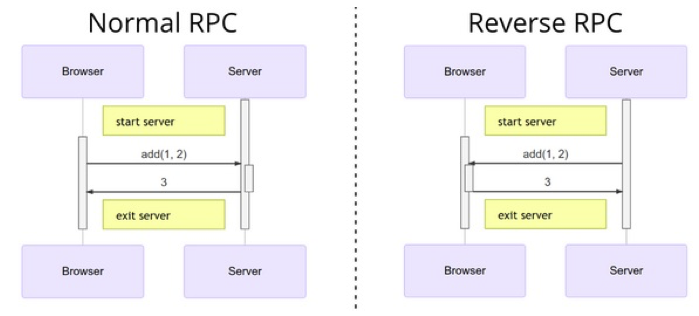

# 3.3 RPC trong Golang

Chúng ta có thể sử dụng RPC cho nhiều mục đích khác nhau, vì vậy cộng đồng Open source đã tạo ra khá nhiều framework RPC để hỗ trợ cho việc lập trình. Trong phần này, chúng ta sẽ sử dụng framework RPC tích hợp sẵn trong Go cho các implement của một số trường hợp.

## 3.3.1 Implement RPC phía client

Cách dễ dàng nhất để sử dụng thư viện GO là dùng phương thức ```Client.Call``` để thực hiện lời gọi đồng bộ (synschronous blocking). Phần implement của phương thức này như sau:

```go
func (client *Client) Call(
    serviceMethod string, args interface{},
    reply interface{},
) error {
    call := <-client.Go(serviceMethod, args, reply, make(chan *Call, 1)).Done
    return call.Error
}
```
Chúng ta cũng có thể dùng ```client.Go``` gọi tới service trước đó là ```HelloService``` theo kiểu bất đồng bộ (synchronous blocking) bằng phương pháp sau:

```go
func doClientWork(client *rpc.Client) {
    helloCall := client.Go("HelloService.Hello", "hello", new(string), nil)

    // do some thing

    helloCall = <-helloCall.Done
    if err := helloCall.Error; err != nil {
        log.Fatal(err)
    }

    args := helloCall.Args.(string)
    reply := helloCall.Reply.(string)
    fmt.Println(args, reply)
}
```
Sau khi lệnh gọi bất đồng bộ được thực hiện, các tác vụ khác sẽ được thực thi, sau đó các tham số đầu vào và giá trị trả về của lời gọi bất đồng bộ có thể lấy ra từ biến ```Call``` trả về.

Phương thức ```Client.Go``` thực thi một lời gọi bất đồng bộ được implement như sau:

```go
func (client *Client) Go(
    serviceMethod string, args interface{},
    reply interface{},
    done chan *Call,
) *Call {
	 // khởi tạo một biến lời gọi đại diện cho cuộc gọi hiện thời
    call := new(Call)
    call.ServiceMethod = serviceMethod
    call.Args = args
    call.Reply = reply
    call.Done = make(chan *Call, 10) // buffered channel.
	 // gửi đi tham số call đến RPC framework.
	 // Client.send method thread-safe cho nên lệnh gọi có thể
	 // gửi từ nhiều Goroutine đồng thời tới cùng một đường link RPC.
    client.send(call)
    return call
}
```
Tham khảo thêm [net/rpc/client.go](https://golang.org/src/net/rpc/client.go).

Khi lời gọi hoàn thành hoặc có lỗi xuất hiện, phương thức thông báo ```call.done``` được gọi để hoàn thành:

```go
func (call *Call) done() {
    select {
    case call.Done <- call:
        // ok
    default:
        // sử dụng default sẽ không bị block chương trình.
        // đảm bảo channel có đủ vùng nhớ cho buffer.
    }
}
```
Từ phần implement của phương thức ```Call.done```, có thể thấy rằng ```call.done``` sẽ trả về lời gọi đã xử lý.

## 3.3.2. Implement hàm giám sát bằng RPC

Ta mong muốn khi hệ thống gặp phải những điều kiện nhất định thì có thể nhận về kết quả thông báo. Trong phần này ta sẽ thực hiện phương thức ```Watch``` để làm điều đó.

Ý tưởng là giả lập một key-value store đơn giản, mỗi khi có sự thay đổi về value thì sẽ gửi về thông báo cho client.

Trước tiên xây dựng cơ sở dữ liệu Key-Value đơn giản thông qua RPC. Service như sau:

```go
type KVStoreService struct {
	 // map lưu trữ key-value
    m      map[string]string
    // map chứa danh sách các hàm filter được xác định trong mỗi call
    filter map[string]func(key string)
    mu     sync.Mutex
}

func NewKVStoreService() *KVStoreService {
    return &KVStoreService{
        m:      make(map[string]string),
        filter: make(map[string]func(key string)),
    }
}
```
Tiếp theo là Get và Set methods:

```go
func (p *KVStoreService) Get(key string, value *string) error {
    p.mu.Lock()
    defer p.mu.Unlock()

    if v, ok := p.m[key]; ok {
        *value = v
        return nil
    }

    return fmt.Errorf("not found")
}

func (p *KVStoreService) Set(kv [2]string, reply *struct{}) error {
    p.mu.Lock()
    defer p.mu.Unlock()

    key, value := kv[0], kv[1]

    if oldValue := p.m[key]; oldValue != value {
    	 // hàm filter được gọi khi value tương ứng với key bị sửa đổi
        for _, fn := range p.filter {
            fn(key)
        }
    }

    p.m[key] = value
    return nil
}
```
Các filter sẽ được cung cấp trong cách phương thức ```Watch```:

```go
// Watch trả về key mỗi khi nhận thấy có sự thay đổi
func (p *KVStoreService) Watch(timeoutSecond int, keyChanged *string) error {
	 // id là một string ghi lại thời gian
    id := fmt.Sprintf("watch-%s-%03d", time.Now(), rand.Int())
    ch := make(chan string, 10) // buffered channel chứa key
	 // filter để theo dõi key thay đổi
    p.mu.Lock()
    p.filter[id] = func(key string) { ch <- key }
    p.mu.Unlock()

    select {
    // trả về timeout sau một khoảng thời gian
    case <-time.After(time.Duration(timeoutSecond) * time.Second):
        return fmt.Errorf("timeout")
    case key := <-ch:
        *keyChanged = key
        return nil
    }
    return nil
}
```
Quá trình đăng ký và khởi động service ```KVStoreService``` bạn có thể xem lại phần trước. Hãy xem cách sử dụng phương thức ```Watch``` từ client:

```go
func doClientWork(client *rpc.Client) {
	 // khởi chạy một Goroutine riêng biệt để giám sát key thay đổi
    go func() {
        var keyChanged string
        // lời gọi `watch` synchronous sẽ block cho đế khi
        // có key thay đổi hoặc timeout
        err := client.Call("KVStoreService.Watch", 30, &keyChanged)
        if err != nil {
            log.Fatal(err)
        }
        fmt.Println("watch:", keyChanged)
    } ()
    // value KV được thay đổi bằng phương thức `Set`
    err := client.Call(
        "KVStoreService.Set", [2]string{"abc", "abc-value"},
        new(struct{}),
    )
    if err != nil {
        log.Fatal(err)
    }
    
    time.Sleep(time.Second*3)
}
```
Server sẽ trả về key đã thay đổi thông qua ```Watch``` method. Bằng cách này ta có thể giám sát việc thay dổi trạng thái key.

## 3.3.3 Reverse RPC

RPC thường được sử dụng trong mô hình client-server. Trong đó server và client cần dùng chung một network. Tuy nhiên, đối với một số trường hợp đặc biệt, chẳng hạn như khi cung cấp RPC service trên mạng nội bộ, nhưng mạng bên ngoài không thể connect tới server mạng nội bộ.
<div align="center">
	
	<br/>
	<span align="center">
		<i>Reverse RPC</i>
	</span>
</div>
<br/>
Trong trường hợp này, có thể sử dụng công nghệ tương tự nhu reverse proxy. Trước tiên chủ động kết nối với server TCP của mạng bên ngoài từ mạng nội bộ, sau đó cung cấp RPC service cho mạng bên ngoài dựa trên TCP connect đó.

Sau đây là mã nguồn để khởi động một reverse RPC service:

```go
func main() {
    rpc.Register(new(HelloService))

    for {
        conn, _ := net.Dial("tcp", "localhost:1234")
        if conn == nil {
            time.Sleep(time.Second)
            continue
        }

        rpc.ServeConn(conn)
        conn.Close()
    }
}
```
Reverse RPC service sẽ không còn cung cấp service lắng nghe TCP, Thay vào đó nó sẽ chủ động kết nối với server TCP của client (có thể coi là đảo ngược vai trò client-server). RPC service sau đó được cung cấp dựa trên mỗi liên kết TCP được thiết lập.

RPC client cần cung cấp một TCP service có địa chỉa công khai để chấp nhật request từ RPC server:

```go
func main() {
    listener, err := net.Listen("tcp", ":1234")
    if err != nil {
        log.Fatal("ListenTCP error:", err)
    }

    clientChan := make(chan *rpc.Client)

    go func() {
        for {
            conn, err := listener.Accept()
            if err != nil {
                log.Fatal("Accept error:", err)
            }
			  // khi mỗi đường link được thiết lập, đối tượng RPC client 
			  // được khởi tạo dựa trên link đó và gửi tới client channel
            clientChan <- rpc.NewClient(conn)
        }
    }()
    doClientWork(clientChan)
}
```
Client thực hiện lời gọi RPC trong ```doClientWork``` method:

```go
func doClientWork(clientChan <-chan *rpc.Client) {
	 // nhận vào đối tượng RPC client từ channel
    client := <-clientChan
    // đóng kết nối với client trước khi hàm exit
    defer client.Close()

    var reply string
    // thực hiện lời gọi rpc bình thường
    err = client.Call("HelloService.Hello", "hello", &reply)
    if err != nil {
        log.Fatal(err)
    }
    fmt.Println(reply)
}
```
## 3.3.4 RPC theo ngữ cảnh (context)

Dựa trên ngữ cảnh (context) chúng ta có thể cung cấp những RPC services thích hợp cho những client khác nhau.
Ta có thể hỗ trợ các tính năng theo ngữ cảnh bằng cách cung cấp các RPC service cho từng link kết nối.

Đầu tiên thêm vào thành phần ```conn``` ở ```HelloService``` cho link tương ứng:

```go
type HelloService struct {
    conn net.Conn
}
```
Sau đó bắt đầu một RPC service riêng cho từng link:

```go
func main() {
    listener, err := net.Listen("tcp", ":1234")
    if err != nil {
        log.Fatal("ListenTCP error:", err)
    }

    for {
        conn, err := listener.Accept()
        if err != nil {
            log.Fatal("Accept error:", err)
        }

        go func() {
            defer conn.Close()

            p := rpc.NewServer()
            p.Register(&HelloService{conn: conn})
            p.ServeConn(conn)
        } ()
    }
}
```
Trong ```Hello``` method, bạn có thể xác định lời gọi RPC cho các link khác nhau dựa trên biến ```conn```:

```go
func (p *HelloService) Hello(request string, reply *string) error {
    *reply = "hello:" + request + ", from" + p.conn.RemoteAddr().String()
    return nil
}
```
Dựa vào thông tin ngữ cảnh mà chúng ta có thể dễ dàng thêm vào một cơ chế xác minh trạng thái đăng nhập đơn giản cho RPC service:

```go
type HelloService struct {
    conn    net.Conn
    isLogin bool
}

func (p *HelloService) Login(request string, reply *string) error {
    if request != "user:password" {
        return fmt.Errorf("auth failed")
    }
    log.Println("login ok")
    p.isLogin = true
    return nil
}

func (p *HelloService) Hello(request string, reply *string) error {
    if !p.isLogin {
        return fmt.Errorf("please login")
    }
    *reply = "hello:" + request + ", from" + p.conn.RemoteAddr().String()
    return nil
}
```
Theo cách này, khi client kết nối tới RPC service, chức năng login sẽ được thực hiện trước, và các service khác có thể thực thi bình thường sau khi login thành công.

[Tiếp theo](ch3-04-bat-dau-grpc.md)