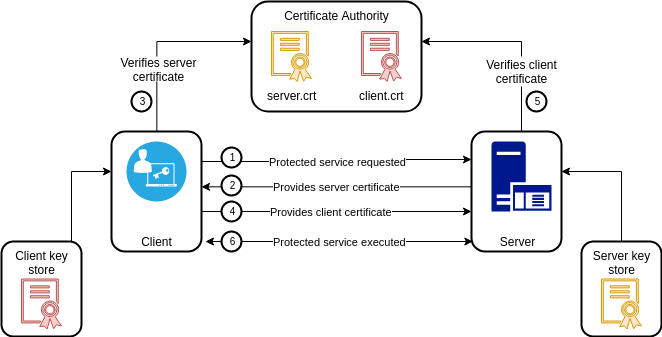
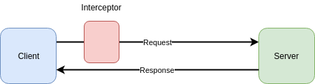

# 3.5 gRPC Nâng cao
Các RPC framework cơ bản thường gặp nhiều vấn đề bảo mật và khả năng mở rộng.

Phần này sẽ mô tả ngắn gọn một số cách xác thực an toàn bằng gRPC. Sau đó giới thiệu tính năng interceptor trên gRPC và cách triển khai cơ chế xác thực Token một cách tốt nhất.

## 3.5.1 Xác thực qua certificate

gRPC được xây dựng dựa trên giao thức HTTP/2 và hỗ trợ TLS khá hoàn thiện. gRPC service trong chương trước không hỗ trợ xác thực qua certificate, vì vậy client ```grpc.WithInsecure()``` có thể thông qua tuỳ chọn mà bỏ qua việc xác thực trong server được kết nối.
<div align="center">
	
	<br/>
	<span align="center">
		<i>Xác thực bằng certificate</i>
	</span>
</div>
<br/>
gRPC service không có xác thực certificate sẽ phải giao tiếp hoàn toàn bằng ```plain-text``` với client và có nguy cơ bị giám sát bởi một bên thứ ba khác. Để khắc phục điểm yếu này, chúng ta có thể sử dụng mã hoá TLS trên server.

Đầu tiên tạo private key và certificate cho server và client riêng biệt bằng các lệnh sau:

```sh
$ openssl genrsa -out server.key 2048
$ openssl req -new -x509 -days 3650 \
    -subj "/C=GB/L=China/O=grpc-server/CN=server.grpc.io" \
    -key server.key -out server.crt

$ openssl genrsa -out client.key 2048
$ openssl req -new -x509 -days 3650 \
    -subj "/C=GB/L=China/O=grpc-client/CN=client.grpc.io" \
    -key client.key -out client.crt
```
Câu lệnh trên sẽ tạo ra 4 file: ```server.key```, ```server.crt```, ```client.key``` và ```client.crt```. File private key có phần mở rộng ```.key``` và cần được giữ bảo mật. File certificate có phần mở rộng ```.crt``` được hiểu như là public key và không cần phải giữ bí mật.

Với certificate đấy ta có thể truyền nó vào tham số để bắt đầu một gRPC service:

```go
func main() {
	// khởi tạo đối tượng certificate từ file cho server
    creds, err := credentials.NewServerTLSFromFile("server.crt", "server.key")
    if err != nil {
        log.Fatal(err)
    }
    // bọc certificate dưới dạng tuỳ chọn thông qua hàm grpc.Creds
    server := grpc.NewServer(grpc.Creds(creds))
    ...
}
```
Server có thể được xác thực ở client dựa trên chứng chỉ của server và tên của nó:

```go
func main() {
	// client xác thực server bằng cách đưa vào chứng chỉ CA root và tên của server
    creds, err := credentials.NewClientTLSFromFile(
        "server.crt", "server.grpc.io",
    )
    if err != nil {
        log.Fatal(err)
    }
    conn, err := grpc.Dial("localhost:5000",
        grpc.WithTransportCredentials(creds),
    )
    if err != nil {
        log.Fatal(err)
    }
    defer conn.Close()
    ...
}
```
Theo cách này, certificate của server cần được thông báo trước cho client, để client có thể xác thực certificate của server kết nối. Trong một môi trường mạng phức tạp, việc truyền certificate của server bản thân nó là một vấn đề rất nguy hiểm. Nếu certificate của server được theo dõi hoặc thay thế tại một thời điểm nào đó, việc xác thực cho server sẽ không còn đang tin cậy nữa.

Để tránh giả mạo trong quá trình cung cấp certificate, certificate của server và client có thể được ký riêng bằng certificate  CA root an toàn và đáng tin cậy. Bằng cách này client và server có thể xác minh tính hợp lệ của certificate thông qua certificate CA root sau khi nhận được certificate của bên kia.

Certificate CA root được tạo theo các tương tự:

```sh
$ openssl genrsa -out ca.key 2048
$ openssl req -new -x509 -days 3650 \
    -subj "/C=GB/L=China/O=gobook/CN=github.com" \
    -key ca.key -out ca.crt
```
Sau đó re-sign certificate phía server:

```sh
$ openssl req -new \
    -subj "/C=GB/L=China/O=server/CN=server.io" \
    -key server.key \
    -out server.csr
$ openssl x509 -req -sha256 \
    -CA ca.crt -CAkey ca.key -CAcreateserial -days 3650 \
    -in server.csr \
    -out server.crt
```

Hai câu lệnh trên sẽ cho ra một file mới có phần mở rộng ```.csr``` thể hiện file yêu cầu ký certificate. File ```.csr``` có thể bị xoá sau khi chữ ký certificate được hoàn thành.

Sau đó khách hàng có thể thực hiện xác minh certificate trên server dựa trên CA certificate.
```go
func main() {
    certificate, err := tls.LoadX509KeyPair("client.crt", "client.key")
    if err != nil {
        log.Fatal(err)
    }

    certPool := x509.NewCertPool()
    ca, err := ioutil.ReadFile("ca.crt")
    if err != nil {
        log.Fatal(err)
    }
    if ok := certPool.AppendCertsFromPEM(ca); !ok {
        log.Fatal("failed to append ca certs")
    }
	// client xác thực server bằng cách giới thiệu chứng chỉ CA root và tên của server
    creds := credentials.NewTLS(&tls.Config{
        Certificates:       []tls.Certificate{certificate},
        ServerName:         tlsServerName, // NOTE: this is required!
        RootCAs:            certPool,
    })

    conn, err := grpc.Dial(
        "localhost:5000", grpc.WithTransportCredentials(creds),
    )
    if err != nil {
        log.Fatal(err)
    }
    defer conn.Close()

    ...
}
```
Khi đó trên client, ta không còn phụ thuộc trực tiếp vào các file certificate phía server.

Khi client kết nối với server, trước tiên nó sẽ yêu cầu chứng chỉ của server, sau đó sử dụng chứng chỉ CA root để xác minh chứng chỉ phía server mà nó nhận được.

Nếu chứng chỉ của client cũng được ký bởi CA root, server cũng có thể thực hiện xác thực chứng chỉ trên client. Ở đây ta sử dụng chứng chỉ CA root để ký chứng chỉ client:

```sh
$ openssl req -new \
    -subj "/C=GB/L=China/O=client/CN=client.io" \
    -key client.key \
    -out client.csr
$ openssl x509 -req -sha256 \
    -CA ca.crt -CAkey ca.key -CAcreateserial -days 3650 \
    -in client.csr \
    -out client.crt
```
Chứng chỉ root được cấu hình lúc khởi động server:

```go
func main() {
    certificate, err := tls.LoadX509KeyPair("server.crt", "server.key")
    if err != nil {
        log.Fatal(err)
    }

    certPool := x509.NewCertPool()
    ca, err := ioutil.ReadFile("ca.crt")
    if err != nil {
        log.Fatal(err)
    }
    if ok := certPool.AppendCertsFromPEM(ca); !ok {
        log.Fatal("failed to append ca certs")
    }
	// Server cũng sử dụng hàm `credentials.NewTLS` để tạo certificate
    creds := credentials.NewTLS(&tls.Config{
        Certificates:       []tls.Certificate{certificate},
        // cho phép client được xác thực
        ClientAuth:         tls.RequireAndVerifyClientCert, // NOTE: this is required!
        // chọn chứng chỉ CA root thông qua ClientCA,
        // this is optional!
        ClientCAs:            certPool,
    })

    server := grpc.NewServer(grpc.Creds(creds))
    ...
}
```
Như vậy ta đã xây dựng được một hệ thống gRPC đáng tin cậy để kết nối Client và Server thông qua xác thực certificate từ cả 2 chiều.

## 3.5.2 Xác thực bằng Token

Xác thực dựa vào certificate ở trên là dành cho từng kết nối gRPC. Ngoài ra gRPC cũng hỗ trợ xác thực cho mỗi lệnh gọi gRPC, để quản lý quyền có thể thực hiện trên các kết nối khác nhau dựa trên ```user token```.

Để implement cơ chế xác thực cho từng phương thức gRPC, ta cần triển khai interface ```grpc.PerRPCCredentials```:

```go
type PerRPCCredentials interface {
    // GetRequestMetadata gets the current request metadata, refreshing
    // tokens if required. This should be called by the transport layer on
    // each request, and the data should be populated in headers or other
    // context. If a status code is returned, it will be used as the status
    // for the RPC. uri is the URI of the entry point for the request.
    // When supported by the underlying implementation, ctx can be used for
    // timeout and cancellation.
    // TODO(zhaoq): Define the set of the qualified keys instead of leaving
    // it as an arbitrary string.
    GetRequestMetadata(ctx context.Context, uri ...string) (
        map[string]string,    error,
    )
    // RequireTransportSecurity indicates whether the credentials requires
    // transport security.
    RequireTransportSecurity() bool
}
```
Ta có thể tạo ra struct ```Authentication``` để xác thực username và password:

```go
type Authentication struct {
    User     string
    Password string
}
// trả về thông tin xác thực cục bộ bao gồm cả user và password
func (a *Authentication) GetRequestMetadata(context.Context, ...string) (
    map[string]string, error,
) {
    return map[string]string{"user":a.User, "password": a.Password}, nil
}
// để đơn giản hơn nên `RequireTransportSecurity` không cần thiết
func (a *Authentication) RequireTransportSecurity() bool {
    return false
}
```
Thông tin token có thể được truyền vào như tham số cho mỗi gRPC service được yêu cầu:

```go
func main() {
    auth := Authentication{
        Login:    "gopher",
        Password: "password",
    }
    // đối tượng `Authentication` được chuyển đổi thành tham số của `grpc.Dial` bằng hàm
    // `grpc. grpc.WithPerRPCCredentials`
    // Vì secure link không được kích hoạt nên cần phải truyền vào `grpc.WithInsecure()`
    // để bỏ qua bước xác thực certificate
    conn, err := grpc.Dial("localhost"+port, grpc.WithInsecure(), grpc.WithPerRPCCredentials(&auth))
    if err != nil {
        log.Fatal(err)
    }
    defer conn.Close()
    ...
}
```
Kế đó trong mỗi phương thức của gRPC server, danh tính người dùng được xác thực bởi phương thức ```Auth``` của ```Authentication```:

```go
type grpcServer struct { auth *Authentication }

func (p *grpcServer) SomeMethod(
    ctx context.Context, in *HelloRequest,
) (*HelloReply, error) {
    if err := p.auth.Auth(ctx); err != nil {
        return nil, err
    }

    return &HelloReply{Message: "Hello " + in.Name}, nil
}
// phương thức thực hiện việc xác thực
func (a *Authentication) Auth(ctx context.Context) error {
	// meta information được lấy từ biến ngữ cảnh ctx
    md, ok := metadata.FromIncomingContext(ctx)
    if !ok {
        return fmt.Errorf("missing credentials")
    }

    var appid string
    var appkey string

    if val, ok := md["login"]; ok { appid = val[0] }
    if val, ok := md["password"]; ok { appkey = val[0] }
	// Nếu xác thực thất bại sẽ trả về lỗi
    if appid != a.Login || appkey != a.Password {
        return grpc.Errorf(codes.Unauthenticated, "invalid token")
    }

    return nil
}
```

## 3.5.3 Interceptor

```Grpc.UnaryInterceptor``` và 'grpc.StreamInterceptor``` trong gRPC hỗ trợ interceptor cho các phương thức thông thường và phương thức stream. Ở đây chúng ta hãy tìm hiểu về việc sử dụng interceptor cho phương thức thông thường.

Để sử dụng hàm interceptor ```filter```, chỉ cần truyền nó vào lời gọi hàm khi bắt đầu một gRPC service:

```go
server := grpc.NewServer(grpc.UnaryInterceptor(filter))
```
<div align="center">
	
	<br/>
	<span align="center">
		<i>Interceptor với hàm filter</i>
	</span>
</div>
<br/>

Để implement một interceptor như vậy, ta tạo ra hàm ```filter``` như sau:

```go
// ctx và req là tham số của phương thức RPC bình thường.
// info chỉ ra phương thức gRPC tương ứng hiện đang được sử dụng 
// và tham số handler tương ứng với hàm gRPC hiện tại
func filter(ctx context.Context,
    req interface{}, info *grpc.UnaryServerInfo,
    handler grpc.UnaryHandler,
) (resp interface{}, err error) {
    log.Println("fileter:", info)
    // gọi tới phương thức gRPC gắn với `handler`
    return handler(ctx, req)
}
```
Nếu hàm interceptor trả về lỗi thì lệnh gọi phương thức gRPC sẽ được coi là failure. Chúng ta lợi dụng điểm này để thực hiện một số xác thực trên các tham số đầu vào và cả kết quả trả về của interceptor.

Sau đây là một interceptor có chức năng thêm một exception cho phương thức gRPC:

```go
func filter(
    ctx context.Context, req interface{},
    info *grpc.UnaryServerInfo,
    handler grpc.UnaryHandler,
) (resp interface{}, err error) {
    log.Println("fileter:", info)
	// nếu có exception thì throw về trước khi gọi tới gRPC
    defer func() {
        if r := recover(); r != nil {
            err = fmt.Errorf("panic: %v", r)
        }
    }()

    return handler(ctx, req)
}
```
Tuy nhiên, chỉ một interceptor có thể được gắn cho một service trong gRPC framework, cho nên tất cả chức năng interceptor chỉ có thể thực thi trong một hàm. Package go-grpc-middleware trong project Open Source [grpc-ecosystem](https://github.com/grpc-ecosystem) có implement cơ chế hỗ trợ cho một chuỗi interceptor dựa trên gRPC.

Một ví dụ về cách sử dụng một chuỗi interceptor trong package go-grpc-middleware:

```go
import "github.com/grpc-ecosystem/go-grpc-middleware"

myServer := grpc.NewServer(
    grpc.UnaryInterceptor(grpc_middleware.ChainUnaryServer(
        filter1, filter2, ...
    )),
    grpc.StreamInterceptor(grpc_middleware.ChainStreamServer(
        filter1, filter2, ...
    )),
)
```
Xem chi tiết: [go-grpc-middleware](https://github.com/grpc-ecosystem/go-grpc-middleware)

## 3.5.4 gRPC kết hợp với Web service

gRPC được xây dựng bên trên HTTP/2 protocol nên chúng ta có thể đặt gRPC service vào các port giống như một web service bình thương.

- Với các service không sử dụng TLS:

```go
func main() {
    mux := http.NewServeMux()
    h2Handler := h2c.NewHandler(mux, &http2.Server{})
    server = &http.Server{Addr: ":3999", Handler: h2Handler}
    server.ListenAndServe()
}
```

- Các service sử dụng TLS:

```go
func main() {
    mux := http.NewServeMux()
    mux.HandleFunc("/", func(w http.ResponseWriter, req *http.Request) {
        fmt.Fprintln(w, "hello")
    })

    http.ListenAndServeTLS(port, "server.crt", "server.key",
        http.HandlerFunc(func(w http.ResponseWriter, r *http.Request) {
            mux.ServeHTTP(w, r)
            return
        }),
    )
}
```
- Kích hoạt một gRPC service với các chứng chỉ riêng (xem phần 3.5.1):

```go
func main() {
    creds, err := credentials.NewServerTLSFromFile("server.crt", "server.key")
    if err != nil {
        log.Fatal(err)
    }
    grpcServer := grpc.NewServer(grpc.Creds(creds))
    ...
}
```
Vì gRPC service đã implement phương thức ```ServeHTTP``` trước đó nên có thể sử dụng là đối tượng xử lý định tuyền Web (routing). Nếu đặt gRPC và Web service lại với nhau, sẽ dẫn đến xung đột link gRPC và link Web. Chúng ta cần phân biệt giữa hai loại service này khi xử lý.

Việc tạo ra các handler xử lý việc routing hỗ trợ cả Web và gRPC có thể dược thực hiện như sau:

```go
func main() {
    ...

    http.ListenAndServeTLS(port, "server.crt", "server.key",
        http.HandlerFunc(func(w http.ResponseWriter, r *http.Request) {
            if r.ProtoMajor != 2 {
                mux.ServeHTTP(w, r)
                return
            }
            if strings.Contains(
                r.Header.Get("Content-Type"), "application/grpc",
            ) {
                grpcServer.ServeHTTP(w, r) // gRPC Server
                return
            }

            mux.ServeHTTP(w, r)
            return
        }),
    )
}
```
Theo cách này ta có thể cung cấp cả web service và gRPC chung port cùng lúc.

[Tiếp theo](ch3-06-grpc-protobuf-extensions.md)